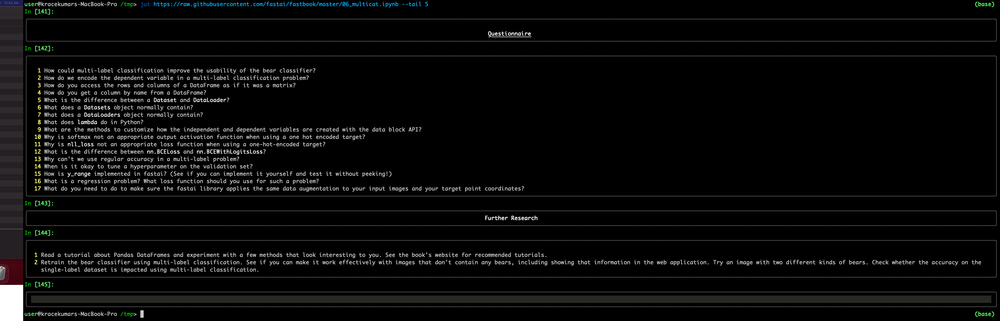

`jut - JUpyter notebook Terminal viewer`.

The command line tool view the IPython/Jupyter notebook in the terminal.

### Install

`pip install jut`

### Usage

``` shell
$jut --help
Usage: jut [OPTIONS]

Options:
  -u, --url TEXT             Render the ipynb file from the URL
  -i, --input-file FILENAME  File from the local file-system
  -h, --head INTEGER         Display first n cells. Default is 10
  -t, --tail INTEGER         Display last n cells
  -p, --single-page          Should the result be in a single page?
  -f, --full-display         Should all the contents in the file displayed?
  --help                     Show this message and exit.

```

### Display first five cells


### Display last five cells



### Download the file and display first five cells


